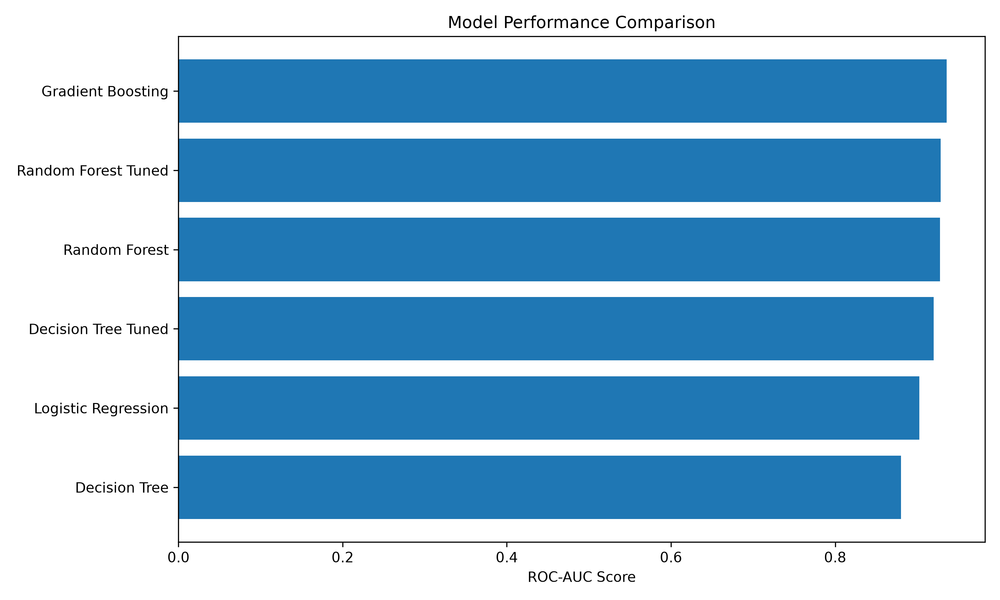
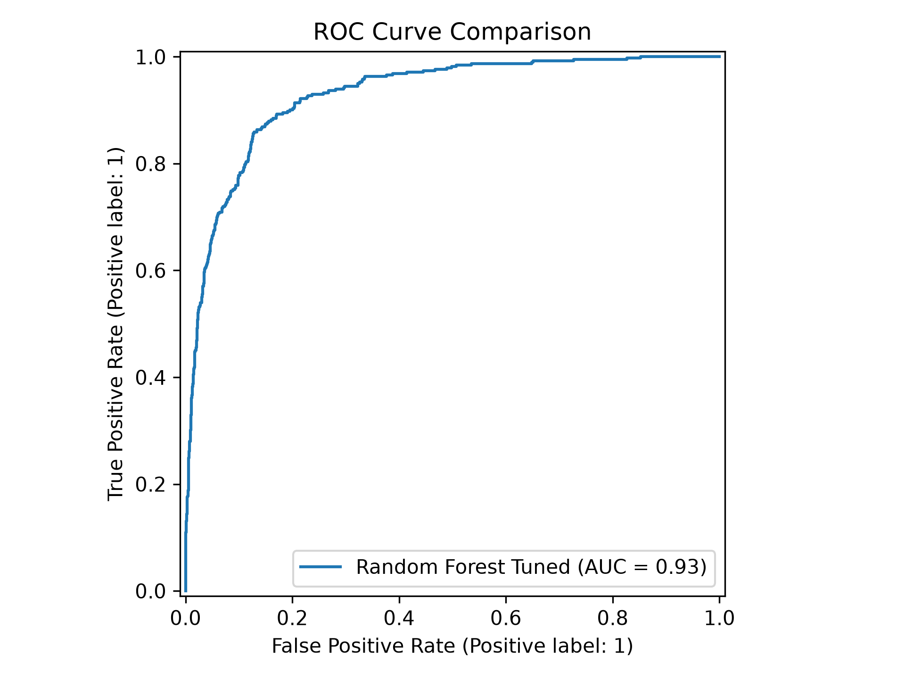
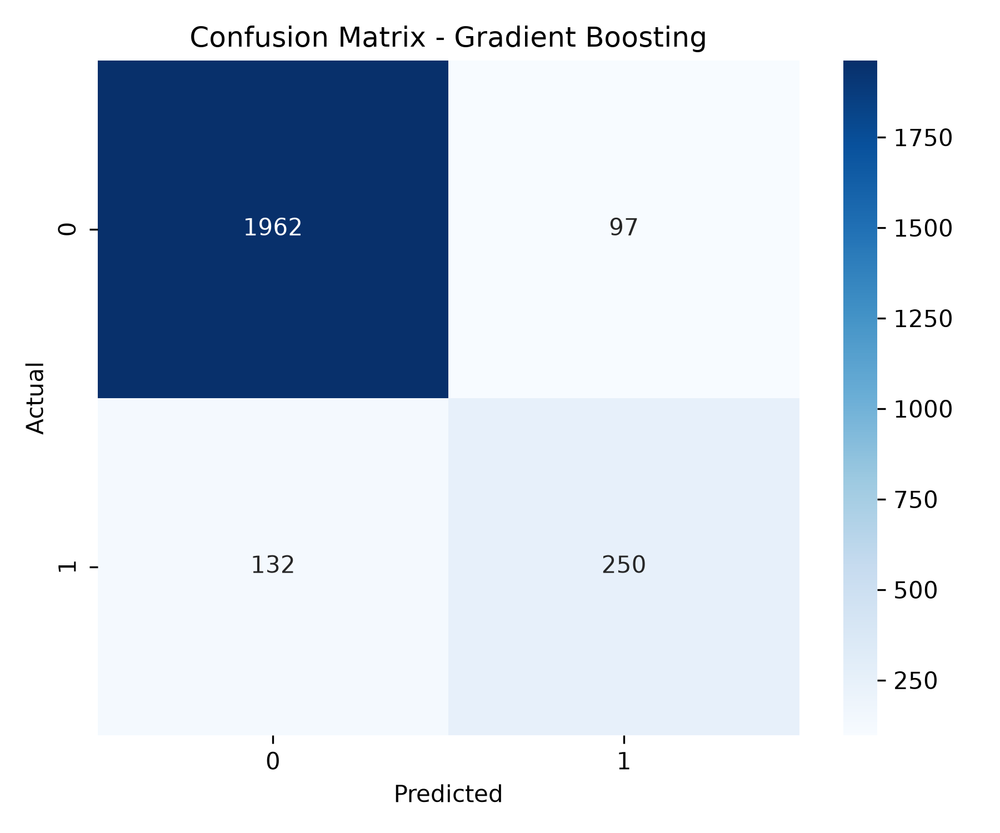
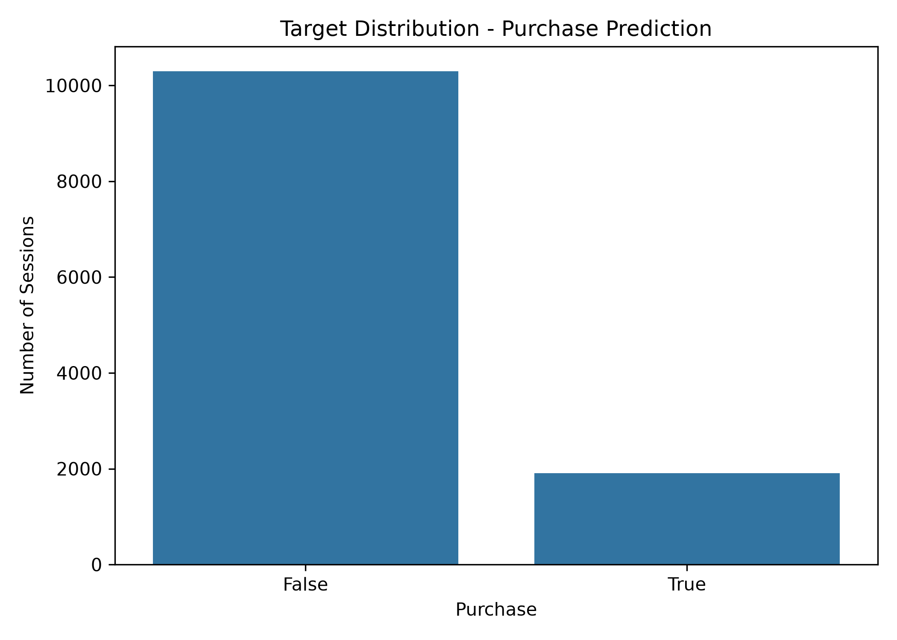
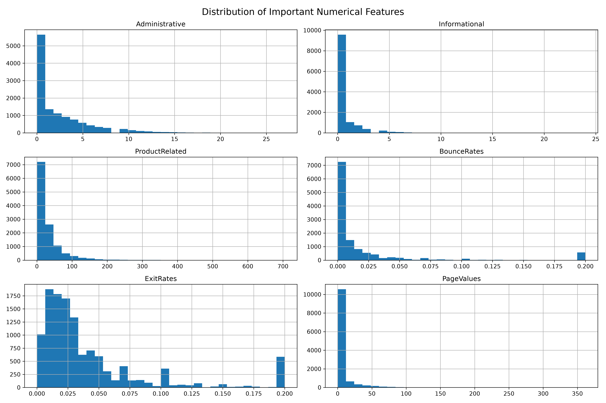
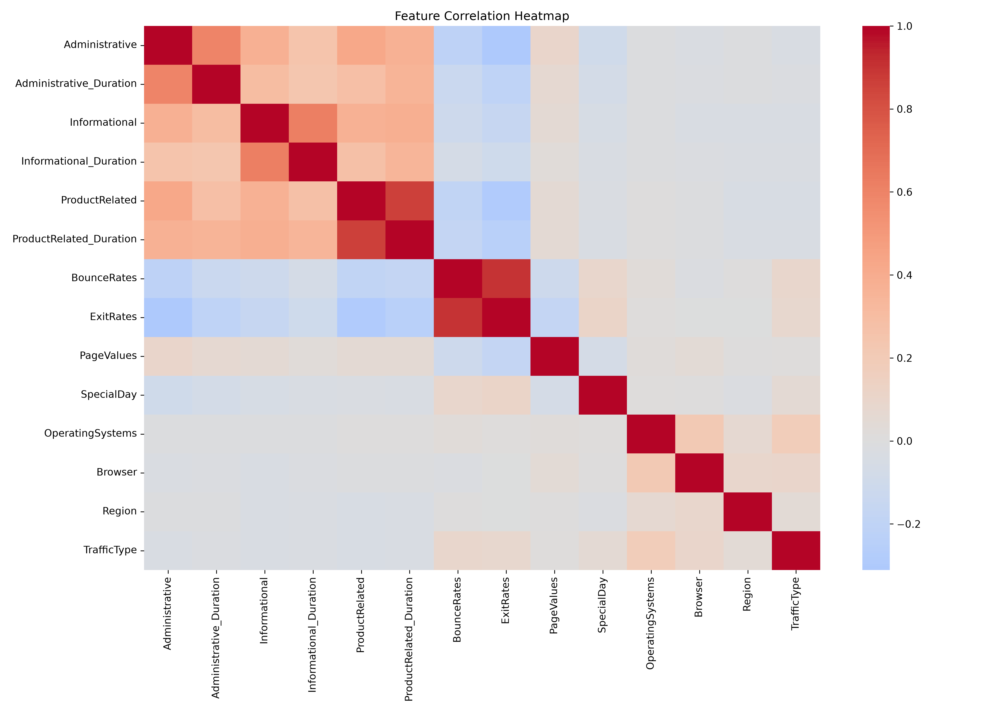

# 🛒 Online Shoppers Purchase Prediction

[](https://www.python.org/)
[](https://scikit-learn.org/)
[](https://pandas.pydata.org/)
[](#-model-evaluation--comparison)
[](#-model-evaluation--comparison)

An end-to-end Machine Learning pipeline that predicts whether an online shopping website session will result in a purchase (`Revenue` = `True`/`False`). By analyzing web metrics, user activity, and temporal attributes, e-commerce businesses can identify high-intent shoppers, reduce cart abandonment, and personalize customer engagement in real-time.

---

## 📌 Table of Contents
- [Project Overview](#-project-overview)
- [Key Results & Best Model](#-key-results--best-model)
- [Dataset Details](#-dataset-details)
- [Project Architecture & Pipeline](#-project-architecture--pipeline)
- [Feature Engineering](#-feature-engineering)
- [Model Evaluation & Comparison](#-model-evaluation--comparison)
- [Visualizations](#-visualizations)
- [Repository Structure](#-repository-structure)
- [Installation & Setup](#-installation--setup)
- [How to Run](#-how-to-run)
- [Inference Example](#-inference-example)
- [Author & Acknowledgments](#-author--acknowledgments)

---

## 🎯 Project Overview

E-commerce conversion rates typically hover between 1.5% and 3.5%. Predicting user purchasing intent during active web browsing empowers businesses to:
- Dynamically display targeted promotional discounts or live chat assistance to high-intent or hesitant shoppers.
- Optimize digital marketing spend and retargeting campaigns.
- Improve checkout funnel navigation and user experience.

This project implements a complete, structured data science workflow from exploratory data analysis and feature engineering to cross-validation, hyperparameter tuning, model persistence, and batch inference.

---

## 🏆 Key Results & Best Model

Among all evaluated models, **Gradient Boosting** achieved superior overall classification performance on the unseen test set:

| Metric | Gradient Boosting (Best Model) | Random Forest (Tuned) |
|---|:---:|:---:|
| **ROC-AUC** | **`0.9357`** | `0.9285` |
| **Accuracy** | **`90.62%`** | `90.58%` |
| **Precision** | **`72.05%`** | `75.85%` |
| **Recall** | **`65.45%`** | `58.38%` |
| **F1 Score** | **`68.59%`** | `65.98%` |
| **5-Fold CV ROC-AUC** | **`0.9293 ± 0.0058`** | `0.9246 ± 0.0040` |

> 💡 **Why Gradient Boosting?** Although Random Forest provided slightly higher precision, Gradient Boosting delivered significantly higher recall (65.45% vs 58.38%) and the highest F1 Score and ROC-AUC. In e-commerce, capturing a higher proportion of potential buyers (higher recall) while maintaining >72% precision minimizes lost revenue opportunities.

---

## 📊 Dataset Details

The dataset used is the **Online Shoppers Purchasing Intention Dataset** from the UCI Machine Learning Repository.

- **Total Records:** 12,330 sessions (cleaned to 12,205 after removing duplicate records)
- **Features:** 18 raw attributes (10 numerical, 8 categorical/binary)
- **Target Variable:** `Revenue` (`True` = Purchase made, `False` = No purchase)
- **Class Balance:**
  - `False` (No Purchase): ~84.5%
  - `True` (Purchase): ~15.5% (Imbalanced classification problem)

### Feature Breakdown
1. **Administrative & Informational Pages:** `Administrative`, `Administrative_Duration`, `Informational`, `Informational_Duration`
2. **Product Pages:** `ProductRelated`, `ProductRelated_Duration`
3. **Google Analytics Metrics:**
   - `BounceRates`: Percentage of visitors who enter and leave from the same page without further interaction.
   - `ExitRates`: Percentage of pageviews that were the last in the session.
   - `PageValues`: Average value of a web page before completing an e-commerce transaction.
   - `SpecialDay`: Closeness of the browsing date to a special day/holiday (e.g., Valentine's Day, Mother's Day).
4. **User & System Attributes:** `OperatingSystems`, `Browser`, `Region`, `TrafficType`, `VisitorType` (Returning / New / Other), `Weekend`, `Month`.

---

## 🧠 Feature Engineering

To better capture shopper browsing intensity and intent, four domain-specific features were engineered:

| Engineered Feature | Calculation | Business Rationale |
|---|---|---|
| **`TotalPages`** | `Administrative + Informational + ProductRelated` | Measures the overall depth of exploration across the website. |
| **`TotalDuration`** | `Administrative_Duration + Informational_Duration + ProductRelated_Duration` | Measures total active session duration across all page types. |
| **`AveragePageDuration`** | `TotalDuration / TotalPages` | Indicates average time spent per page, reflecting user attention span. |
| **`EngagementScore`** | `TotalPages * AveragePageDuration` | Composite metric capturing browsing intensity and engagement. |

### Preprocessing Pipeline:
- **Numerical Features:** Standardized with `StandardScaler`.
- **Categorical Features:** One-hot encoded using `OneHotEncoder(handle_unknown='ignore')`.
- Built cleanly using Scikit-Learn's `ColumnTransformer` and serialized for deployment.

---

## 📈 Model Evaluation & Comparison

### Final Test Set Performance

| Rank | Model | Accuracy | Precision | Recall | F1 Score | ROC-AUC |
|:---:|---|:---:|:---:|:---:|:---:|:---:|
| 🥇 | **Gradient Boosting** | **90.62%** | **72.05%** | **65.45%** | **68.59%** | **0.9357** |
| 🥈 | **Random Forest Tuned** | 90.58% | 75.85% | 58.38% | 65.98% | 0.9285 |
| 🥉 | **Random Forest (Baseline)** | 90.50% | 75.68% | 57.85% | 65.58% | 0.9277 |
| 4 | **Decision Tree Tuned** | 90.21% | 75.81% | 54.97% | 63.73% | 0.9201 |
| 5 | **Decision Tree (Baseline)** | 89.64% | 70.87% | 57.33% | 63.39% | 0.8803 |
| 6 | **Logistic Regression** | 88.86% | 75.46% | 42.67% | 54.52% | 0.9025 |

### 5-Fold Stratified Cross-Validation (ROC-AUC)

| Model | Fold 1 | Fold 2 | Fold 3 | Fold 4 | Fold 5 | Mean ROC-AUC | Std Dev |
|---|:---:|:---:|:---:|:---:|:---:|:---:|:---:|
| **Gradient Boosting** | 0.9272 | 0.9217 | 0.9277 | 0.9393 | 0.9306 | **0.9293** | ±0.0058 |
| **Random Forest** | 0.9221 | 0.9207 | 0.9284 | 0.9304 | 0.9212 | **0.9246** | ±0.0040 |
| **Logistic Regression** | 0.8931 | 0.8627 | 0.8983 | 0.8962 | 0.8982 | **0.8897** | ±0.0137 |
| **Decision Tree** | 0.8767 | 0.8724 | 0.8891 | 0.9018 | 0.8772 | **0.8834** | ±0.0107 |

---

## 🖼️ Visualizations

### 1. Model Comparison & ROC Curves
| Model Performance Comparison | ROC Curve Comparison |
|:---:|:---:|
|  |  |

### 2. Confusion Matrix & Target Distribution
| Confusion Matrix (Best Model) | Target Class Distribution |
|:---:|:---:|
|  |  |

### 3. Feature Distribution & Correlation Heatmap
| Feature Distribution | Feature Correlation Heatmap |
|:---:|:---:|
|  |  |

---

## 📁 Repository Structure

```plaintext
online_shoppers_purchase_prediction/
│
├── data/
│   └── online_shoppers_intention.csv     # Raw dataset from UCI ML repository
│
├── notebooks/
│   ├── 01_eda_preprocessing.ipynb        # EDA, missing values, duplicates, outliers
│   ├── 02_feature_engineering.ipynb      # Feature derivation & preprocessing pipelines
│   ├── 03_model_training_validation.ipynb # Baseline model training & 5-fold CV
│   ├── 04_model_evaluation.ipynb         # Hyperparameter tuning, ROC curves, confusion matrix
│   ├── 05_final_prediction.ipynb         # Inference on unseen test data
│   └── 06_final_results.ipynb            # Consolidated results and business insights
│
├── outputs/
│   ├── figures/                          # Exported plots (ROC, PR, confusion matrix, etc.)
│   ├── cleaned_data.csv                  # Processed and cleaned dataset
│   ├── train_data.csv                    # Train split with engineered features
│   ├── test_data.csv                     # Test split with engineered features
│   ├── final_predictions.csv             # Model output predictions
│   ├── initial_model_results.csv         # Baseline evaluation metrics
│   ├── cross_validation_results.csv      # K-fold cross-validation results
│   └── model_results.csv                 # Final model benchmark comparison table
│
├── .gitignore                            # Git ignore rules
├── requirements.txt                      # Project Python dependencies
└── README.md                             # Project documentation
```

---

## ⚙️ Installation & Setup

### 1. Clone the repository
```bash
git clone https://github.com/graru2001/online-shoppers-purchase-prediction.git
cd online-shoppers-purchase-prediction
```

### 2. Set up a virtual environment
```bash
# Windows
python -m venv .venv
.venv\Scripts\activate

# Linux / macOS
python3 -m venv .venv
source .venv/bin/activate
```

### 3. Install required packages
```bash
pip install -r requirements.txt
```

---

## 🚀 How to Run

Launch Jupyter Lab / Notebook to interactively run the pipeline:
```bash
jupyter notebook
```

Navigate to `notebooks/` and execute in chronological order:
1. `01_eda_preprocessing.ipynb`: Data exploration and cleaning.
2. `02_feature_engineering.ipynb`: Generates transformed datasets (`train_data.csv`, `test_data.csv`).
3. `03_model_training_validation.ipynb`: Trains baseline models and evaluates cross-validation.
4. `04_model_evaluation.ipynb`: Tunes models with GridSearchCV/RandomizedSearchCV and plots ROC/PR curves.
5. `05_final_prediction.ipynb`: Runs inference on new customer sessions.
6. `06_final_results.ipynb`: Displays executive summary and final metric dashboards.

---

## 🔮 Inference Example

You can easily load the trained model and generate predictions on new session data:

```python
import joblib
import pandas as pd

# 1. Load the pre-trained Gradient Boosting model
model = joblib.load("outputs/best_model.pkl")

# 2. Example session feature vector (with engineered features)
new_session = pd.DataFrame([{
    "Administrative": 3,
    "Administrative_Duration": 85.0,
    "Informational": 1,
    "Informational_Duration": 24.0,
    "ProductRelated": 25,
    "ProductRelated_Duration": 650.0,
    "BounceRates": 0.01,
    "ExitRates": 0.02,
    "PageValues": 35.5,
    "SpecialDay": 0.0,
    "Month": "Nov",
    "OperatingSystems": 2,
    "Browser": 2,
    "Region": 1,
    "TrafficType": 2,
    "VisitorType": "Returning_Visitor",
    "Weekend": False,
    "TotalPages": 29,
    "TotalDuration": 759.0,
    "AveragePageDuration": 26.17,
    "EngagementScore": 758.93
}])

# 3. Predict Purchase Intent
prediction = model.predict(new_session)
probability = model.predict_proba(new_session)[:, 1]

print(f"Purchase Intent: {'Will Buy (True)' if prediction[0] == 1 else 'Will Not Buy (False)'}")
print(f"Purchase Probability: {probability[0]:.2%}")
```

---

## 👨‍💻 Author & Acknowledgments

- **Author:** Arun ([@graru2001](https://github.com/graru2001))
- **Dataset:** UCI Machine Learning Repository: *Sakar, C.O., Polat, S.O., Katircioglu, M. et al. Real-time prediction of online shoppers' purchasing intention using multilayer perceptron and LSTM recurrent neural networks. Neural Comput & Applic (2018).*
